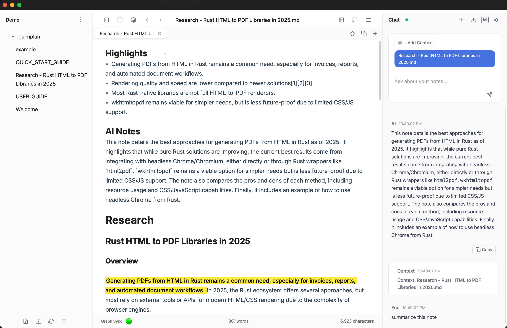

# Gaimplan

**The first context engine that turns your knowledge into AI superpowers.**

Gaimplan does something radically different: it progressively synthesizes everything in your knowledge vault into structured context that makes AI understand YOUR world. No generic fluffy responses.. Gaimplan outputs feel like an AI Agent that's been working with you for years.

Here's the breakthrough: Instead of starting from zero with every AI interaction, Gaimplan builds a living context vault from your notes, highlights, and connections. Every document strengthens the bridge between your expertise and AI's capabilities. Write about a bug you solved, highlight a key insight from research, tag a pattern you've noticed—Gaimplan transforms these into context that amplifies AI output by 1000x.

This isn't "ChatGPT in a notes app." It's the missing infrastructure for human-AI collaboration—where your domain knowledge becomes the foundation for achieving superhuman intelligence.



---

## 🛠️ The Context Engine Stack

*   **🔮 Progressive Context Synthesis:** Every note, highlight, and tag compounds into deeper AI understanding
*   **🧬 Dual Memory Architecture:** Neo4j knowledge graph + Qdrant semantic search = comprehensive context
*   **🤖 MCP-Native Agent Integration:** Built for the agent future with Model Context Protocol at its core
*   **🏷️ AI-First Tags:** Tags aren't metadata—they're context amplifiers that expand AI's understanding
*   **⚡ Living Knowledge Vault:** Local-first, secure, and blazing fast with Tauri + Rust
*   **🎯 Multi-Model Support:** OpenAI, Gemini, Ollama, LM Studio—all with persistent context
*   **📄 Universal Ingestion:** PDFs, images, code, markdown—everything becomes context

## ⚡ What Makes This Different

**ChatGPT/Claude:** Start from zero every conversation. You explain context again and again.
- **Gaimplan:** Every conversation builds on your entire knowledge history. AI already knows your patterns.

**Notion AI:** Operates on one document at a time. Can't see connections.
- **Gaimplan:** Traverses your entire knowledge graph. Finds patterns across months of thinking.

**Obsidian + AI Plugin:** You manually select what context to share. Static embeddings
- **Gaimplan:** Progressive context synthesis. Your highlights and tags automatically expand AI's understanding.

**Cursor/Copilot:** Sees your code, not your reasoning.
- **Gaimplan:** Captures the WHY behind your decisions, making AI suggestions align with your architectural philosophy.

## 🧠 How Gaimplan Builds Your Context Engine

**Example 1: The Debugging Pattern**
- You write: "Fixed auth bug - race condition in token refresh"
- You highlight: The specific code pattern that caused it
- Gaimplan synthesizes: Creates context linking this to 3 similar bugs you've solved
- Next time you ask AI: "I'm seeing weird auth failures"
- AI responds with: Your exact debugging pattern, the race condition history, and suggests checking the token refresh logic you've highlighted before

**Example 2: The Research Synthesis**
- Monday: You save papers on distributed systems, highlight key theorems
- Tuesday: You note connections between consensus algorithms
- Wednesday: You tag #byzantine-fault-tolerance across several notes
- Thursday: You ask AI about system design
- AI output: Incorporates YOUR specific research focus, references the exact theorems you found important, and builds on the connections you've been exploring

**Example 3: The Product Evolution**
- Week 1: Customer feedback notes with pain points highlighted
- Week 2: Technical architecture decisions tagged #core-infrastructure  
- Week 3: Competitor analysis with key differentiators marked
- Ask AI: "How should we position our next feature?"
- AI synthesizes: Your exact customer pain points, your architectural constraints, and competitive gaps—not generic product advice

## 🚀 Getting Started (Beta)

Gaimplan is open source and we welcome contributions!

### Prerequisites

- **Docker Desktop:** Required for Neo4j and Qdrant databases. [Download here](https://www.docker.com/products/docker-desktop/)
- **Rust:** Required for building the Tauri app
- **Node.js:** Version 22 or later
- **npm:** Version 10 or later

### Quick Start

```bash
# Clone the repository
git clone https://github.com/gaimplan/gaimplan.git
cd Gaimplan

# IMPORTANT: Start Docker containers first
docker compose up -d

# Verify containers are running
docker ps
# You should see gaimplan-neo4j-shared and gaimplan-qdrant-shared containers

# Check Dependencies 

# Cargo for Rust must be installed
which cargo

# If not installed, use following to install Rust which includes Cargo
curl --proto '=https' --tlsv1.2 -sSf https://sh.rustup.rs | sh -s -- -y

# Make Cargo available in the current shell:
source "$HOME/.cargo/env"

# Verify Cargo is available:
cargo --version

# Verify Node version 22 or later and NPM version 10 or later are installed: 
node --version && npm --version

# Install dependencies
npm install

# Run the development server
npm run tauri dev
```

### Docker Services

Gaimplan's context engine relies on two powerful databases:

- **Neo4j (Port 7474, 7687):** Powers the knowledge graph connecting your ideas
- **Qdrant (Port 6333, 6334):** Enables semantic search across your context vault

To manage these services:

```bash
# Start services
docker compose up -d

# Stop services
docker compose down

# View logs
docker compose logs -f

# Remove all data (warning: this deletes your context engine!)
docker compose down -v
```

### Contributing

Join us in building the future of human-AI collaboration:

*   **🐛 Report Bugs:** [Open an issue](https://github.com/gaimplan/gaimplan/issues/new?template=bug_report.md)
*   **💡 Request Features:** [Share your ideas](https://github.com/gaimplan/gaimplan/issues/new?template=feature_request.md)
*   **🧑‍💻 Submit Code:** Fork, build, and open a PR

## 💾 Data Philosophy

Your context vault is yours. Forever.

**Your Notes:** Plain Markdown files in your chosen vault folder. No lock-in, no proprietary formats.

**App Settings:** Stored in your system's app directory:
- **macOS:** `~/Library/Application Support/com.gaimplan.app/`
- **Windows:** `C:\Users\{username}\AppData\Roaming\com.gaimplan.app\`
- **Linux:** `~/.config/com.gaimplan.app/`

## 📚 Documentation

- [MCP Integration Guide](.docs/MCP_INTEGRATION.md) - Deep dive into our Model Context Protocol implementation
- [Development Guide](.docs/PRD.md) - Architecture and contribution guidelines
- [Data Storage Guide](.docs/DATA_STORAGE.md) - Understanding your context vault structure

## 🗺️ The Road to Superhuman Intelligence

### ✅ Foundation Laid
*   **🏷️ AI-First Tags:** Revolutionary context amplification through intelligent tagging
*   **🤖 Multi-Agent Memory:** Persistent contexts across AI providers
*   **🔧 MCP Native:** Full Model Context Protocol integration
*   **📓 Progressive Capture:** Daily notes with context accumulation

### 🚧 Building Now
*   **🖥️ Terminal Mode:** Direct integration with Claude Code/Gemini Code
*   **✏️ Context Editing:** AI modifies notes based on conversation insights
*   **👥 Entity Intelligence:** Track people, projects, and contexts with AI-aware status

### 🚀 The Horizon
*   **📱 Mobile Context:** iOS app for capturing context on the go
*   **🔄 Team Vaults:** Shared context engines for collaborative intelligence
*   **🧠 Context Analytics:** Visualize how your knowledge compounds
*   **🌐 Agent Marketplace:** Connect specialized AI agents to your context

## 📄 License

Gaimplan is licensed under the [Apache 2.0 License](LICENSE).

---

**Built for the future where human creativity and AI capability unite to achieve the impossible.**